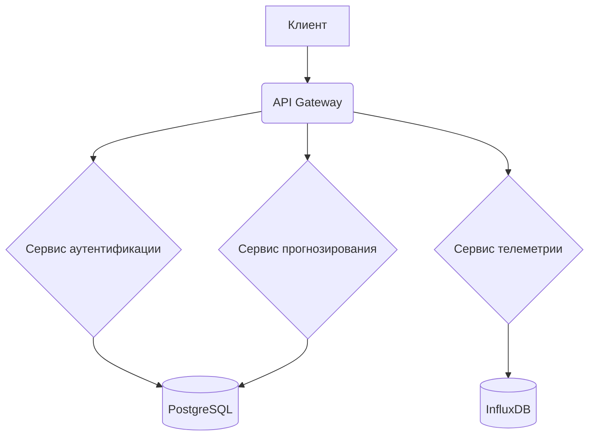

# Проект ИС ПТО для АО "СибКа"

Информационная система предиктивного технического обслуживания карьерной техники.

## Ключевые особенности

*   **Сбор телеметрии** — данные с датчиков температуры, вибрации и давления.
*   **Предиктивная аналитика** — прогнозирование отказов на основе машинного обучения.
*   **Интеграция** — взаимодействие с ERP (1С:УПП) и СЭД.
*   **Веб-интерфейс** — дашборды для инженеров, механиков и руководства.

## Структура данных

## Команда проекта

*   Инженер-программист
*   Системный аналитик

## Технологии

*   Python 3.9+
*   Git, GitHub Actions
*   MySQL / PostgreSQL

## Примечание

Wiki в GitHub доступен только для публичных репозиториев на бесплатном тарифе. Документация размещена в README.md.
